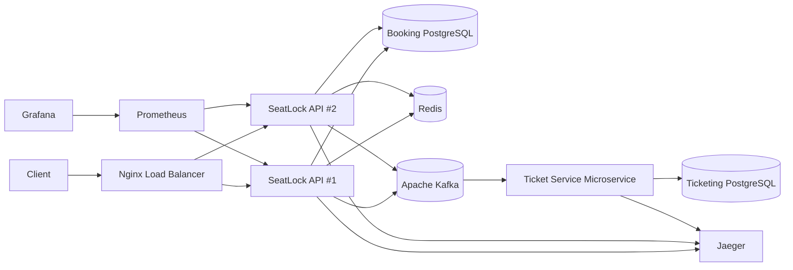

# SeatLock

**SeatLock** is a high-concurrency event ticketing backend built with **NestJS, PostgreSQL, Redis, BullMQ, Apache Kafka, Socket.IO, Prisma, Nginx, Docker, Prometheus, Grafana, and OpenTelemetry**.

The system follows a **microservice-oriented architecture**: the main booking API manages seat and order state, while an independently running **Ticket Service microservice** consumes payment events through Kafka and owns a separate PostgreSQL database.

The project focuses on backend problems that appear in real ticketing systems: preventing multiple users from acquiring the same seat, coordinating payment and expiration races, publishing events reliably, processing duplicate messages safely, synchronizing realtime updates across multiple API instances, and preserving consistency when infrastructure fails.

---

## Technology Stack

| Area                          | Technology                   |
| ----------------------------- | ---------------------------- |
| Runtime                       | Node.js                      |
| Language                      | TypeScript                   |
| Backend Framework             | NestJS                       |
| Database                      | PostgreSQL                   |
| ORM                           | Prisma                       |
| Messaging                     | Apache Kafka                 |
| Cache / Coordination          | Redis                        |
| Background Jobs               | BullMQ                       |
| Realtime                      | Socket.IO + Redis Adapter    |
| Microservices                 | NestJS Microservices + Kafka |
| Reverse Proxy / Load Balancer | Nginx                        |
| Metrics                       | Prometheus                   |
| Dashboards                    | Grafana                      |
| Distributed Tracing           | OpenTelemetry + Jaeger       |
| Validation                    | class-validator, Zod         |
| Testing                       | Jest, Supertest              |
| Load Testing                  | k6                           |
| Infrastructure                | Docker, Docker Compose       |

### Engineering Highlights

- Atomic seat acquisition under concurrent requests
- Transaction-safe reservation and payment state transitions
- Transactional Outbox with distributed leasing, retries, dead-lettering, and redrive
- Kafka-driven Ticket Service microservice with independent database ownership
- Idempotent event consumption using the Inbox Pattern
- Redis/BullMQ background processing for order expiration
- Multi-instance realtime updates using Socket.IO + Redis Adapter
- Nginx load balancing across multiple API instances
- Prometheus metrics and distributed OpenTelemetry tracing
- Concurrency, integration, load, failover, Kafka-outage, and Redis-outage testing
- Full production-style Docker Compose environment

---

## Why SeatLock?

A ticketing backend becomes difficult when multiple users and background processes compete over the same business state.

The interesting problems are not simply how to create an Event or an Order.

They are questions such as:

> What happens if 20 users try to hold the same seat at exactly the same time?

> What if payment succeeds while an expiration worker is trying to cancel the same order?

> What if the database transaction commits but Kafka is temporarily unavailable?

> What if Kafka delivers the same event more than once?

> What if an API instance crashes after committing a booking but before returning the HTTP response?

SeatLock was designed around these problems.

---

## Architecture



The main API owns booking state, while the Ticket Service consumes payment events through Kafka and owns a separate ticketing database.

PostgreSQL remains the source of truth. Redis, Kafka, BullMQ, and Socket.IO support scalability and asynchronous processing without owning the authoritative booking state.

---

## Booking State Machine

An event seat follows a controlled lifecycle:

```text
AVAILABLE
    ↓
  HELD
    ↓
RESERVED
    ↓
 BOOKED
```

Seats may also return to `AVAILABLE` when a hold is released, expires, or when an unpaid reservation is cancelled.

Critical transitions use conditional database operations instead of an unsafe read-check-write sequence.

For example, seat acquisition is not implemented as:

```text
SELECT seat
↓
check status in application
↓
UPDATE seat
```

because two concurrent requests could both observe the seat as available.

Instead, SeatLock performs an atomic conditional update so only one request can transition the seat successfully.

A dedicated concurrency test sends **20 simultaneous hold attempts** against the same seat and verifies that only one succeeds.

---

## Reservation and Payment Consistency

A valid reservation performs the following work inside a transaction:

```text
EventSeat
HELD → RESERVED

Order
created as PENDING

Outbox
ORDER_EXPIRATION created
```

This ensures the seat reservation, order, and asynchronous expiration workflow cannot become inconsistent.

Payment follows the same principle:

```text
Order
PENDING → PAID

EventSeat
RESERVED → BOOKED

Outbox
ORDER_PAID created
```

All operations commit together or roll back together.

The project also includes an integration test for the race between **payment and order expiration**, ensuring two competing processes cannot produce contradictory final states.

---

## Transactional Outbox

Publishing directly to Kafka after committing a database transaction creates a dual-write problem:

```text
Database commit succeeds
        ↓
Kafka publish fails
```

The booking would be stored successfully, but downstream services might never learn about it.

SeatLock solves this with the **Transactional Outbox Pattern**:

```text
Business Transaction
        │
        ├── Update business state
        │
        └── Store OutboxEvent
                    │
                    ▼
             Outbox Dispatcher
                    │
                    ▼
                  Kafka
```

The dispatcher supports:

- distributed leasing between API instances
- stale-lock recovery
- exponential retry backoff
- configurable maximum attempts
- dead-lettering
- manual redrive

This allows Kafka delivery to recover independently without losing the original business event.

---

## Ticket Service Microservice

Ticket generation is handled by an independently running Kafka consumer microservice:

```text
SeatLock API
     ↓
ORDER_PAID
     ↓
Kafka
     ↓
Ticket Service
     ↓
Ticketing PostgreSQL
```

The Ticket Service owns its own PostgreSQL database instead of querying the main booking database.

This creates an actual service and data-ownership boundary rather than simply separating code into another module.

The booking API is responsible for reservation and order state, while the Ticket Service is responsible for turning completed payments into tickets.

---

## Idempotent Event Consumption

Kafka messages may be delivered more than once, so ticket creation must be idempotent.

The Ticket Service uses an Inbox record with a unique constraint based on:

```text
consumer + eventId
```

The Inbox record and Ticket are created in the same database transaction.

As a result:

```text
same Kafka event delivered multiple times
                ↓
only one Ticket is created
```

This protects the service from duplicate Kafka delivery without relying on exactly-once message delivery.

---

## Background Processing and Realtime Updates

**BullMQ + Redis** are used for delayed order expiration.

If a pending order reaches its payment deadline, the worker safely transitions:

```text
Order
PENDING → CANCELLED

EventSeat
RESERVED → AVAILABLE
```

The expiration logic is designed to remain safe when competing with a concurrent payment request.

Seat status changes are also published to clients through **Socket.IO**.

Clients subscribe to event-specific rooms:

```text
event:<eventId>
```

Realtime updates are emitted only after successful database commits, preventing clients from observing state that may later roll back.

Because multiple API instances can serve WebSocket clients, SeatLock uses the **Socket.IO Redis Adapter** to propagate updates across instances.

```text
API #1
   \
    Redis
   /
API #2
```

A client connected to one API instance can therefore receive a change produced by another.

---

## Failure Handling

SeatLock was intentionally tested under infrastructure and process failures.

### Kafka Outage

A successful payment is not rolled back simply because Kafka is unavailable.

```text
Payment commits
      ↓
ORDER_PAID remains in Outbox
      ↓
Kafka unavailable
      ↓
Dispatcher retries
      ↓
Kafka recovers
      ↓
Event delivered
```

### Redis Outage

PostgreSQL remains authoritative.

A Redis failure may temporarily degrade realtime propagation and background queues, but it does not change the durable booking state.

### API Instance Failure

Multiple API instances run behind Nginx.

Failover testing verified that traffic can continue through the remaining API instance if one process becomes unavailable.

The tests also demonstrated an important distributed-systems behavior:

```text
Database commit succeeds
        ↓
API crashes before response
        ↓
Client observes failure
```

The transport request failed from the client's perspective, but the business operation may already have succeeded.

For this reason, Nginx is intentionally not configured to blindly retry non-idempotent booking or payment requests.

---

## Observability

SeatLock includes metrics, structured logging, correlation IDs, and distributed tracing.

### Prometheus

Custom metrics include:

```text
seatlock_http_request_duration_seconds
seatlock_seat_hold_total
seatlock_payment_total
seatlock_outbox_retry_total
seatlock_outbox_dead_letter_total
```

Prometheus:

```text
http://localhost:9090
```

### Grafana

```text
http://localhost:3002
```

### OpenTelemetry + Jaeger

Tracing covers asynchronous boundaries as well as HTTP processing.

A distributed trace can follow:

```text
HTTP Request
    ↓
Payment Transaction
    ↓
Transactional Outbox
    ↓
Kafka Producer
    ↓
Kafka
    ↓
Kafka Consumer
    ↓
Ticket Service
```

Trace context is propagated through Kafka headers so the Ticket Service can continue the trace created upstream.

Jaeger:

```text
http://localhost:16686
```

---

## Health and Lifecycle Management

SeatLock exposes separate health endpoints:

```http
GET /health/live
GET /health/ready
```

`/health/live` answers whether the process is alive.

`/health/ready` checks whether the instance is ready to serve traffic, including critical dependencies such as PostgreSQL, Redis, and Kafka.

The application also uses graceful shutdown hooks to close database, Kafka, Redis, BullMQ, and background-processing resources cleanly.

---

## Project Structure

```text
seatlock/
│
├── src/
│   ├── config/
│   ├── database/
│   ├── venues/
│   ├── seats/
│   ├── events/
│   ├── event-seats/
│   ├── orders/
│   ├── outbox/
│   ├── kafka/
│   ├── realtime/
│   ├── health/
│   ├── metrics/
│   ├── telemetry/
│   ├── contracts/
│   └── ticket-service/
│
├── prisma/
├── prisma-ticketing/
│
├── infra/
├── load/
├── test/
│
├── Dockerfile
├── docker-compose.yml
├── docker-compose.prod.yml
└── package.json
```

---

## Running the Complete System

The complete production-style stack can be started with:

```bash
docker compose -f docker-compose.prod.yml up --build -d
```

Check service status:

```bash
docker compose -f docker-compose.prod.yml ps
```

The environment includes:

```text
Nginx

API Instance #1
API Instance #2

Ticket Service Microservice

Booking PostgreSQL
Ticketing PostgreSQL

Redis
Kafka

Prometheus
Grafana
Jaeger
```

Requests enter through Nginx:

```text
http://localhost:8080
```

Example:

```bash
curl http://localhost:8080/health/ready
```

No manually started NestJS process is required when using the production-style Docker environment.

---

## Local Development

Install dependencies:

```bash
npm install
```

Start infrastructure:

```bash
docker compose up -d
```

Start the main API:

```bash
npm run start:dev
```

Start the Ticket Service:

```bash
npm run start:ticket:dev
```

---

## Testing

Run the standard test suite:

```bash
npm test
```

Run integration tests:

```bash
npm run test:integration
```

Important tested scenarios include:

- concurrent seat holding
- payment rollback
- payment vs expiration race
- duplicate Kafka delivery
- idempotent ticket creation
- API failover
- Kafka outage and recovery
- Redis outage behavior

---

## Load Testing

SeatLock was load-tested locally with k6 while two API instances ran behind Nginx.

Representative results:

| Virtual Users | Approx. Request Rate | Average Latency | p95 Latency | Failures |
| ------------: | -------------------: | --------------: | ----------: | -------: |
|            25 |            158 req/s |         27.9 ms |     52.4 ms |        0 |
|            50 |            271 req/s |         46.2 ms |    104.1 ms |        0 |
|            75 |            193 req/s |         64.4 ms |    173.6 ms |        0 |
|           100 |            261 req/s |         79.9 ms |    216.6 ms |        0 |

These results were collected on a local development machine while the supporting infrastructure was also running, so they should be treated as **engineering validation rather than production benchmarks**.

---

## End-to-End Validation

The complete Dockerized system was verified using a real booking flow:

```text
Create Venue
     ↓
Create Seat
     ↓
Create Event
     ↓
Attach Seat to Event
     ↓
Hold Seat
     ↓
Reserve Seat
     ↓
Create PENDING Order
     ↓
Pay Order
     ↓
Seat becomes BOOKED
     ↓
ORDER_PAID stored in Outbox
     ↓
Kafka
     ↓
Ticket Service
     ↓
Ticket created in Ticketing PostgreSQL
```

This validates the complete distributed path rather than testing each component only in isolation.

---

## Design Principles

**PostgreSQL is the source of truth.**  
Redis, Kafka, queues, and WebSockets support the system but do not determine seat ownership.

**Critical state transitions are atomic.**  
Concurrency-sensitive operations use conditional writes and transactions.

**Important events are stored before being published.**  
The transactional outbox protects against lost events.

**Consumers are idempotent.**  
Kafka redelivery cannot create duplicate tickets.

**Services own their data.**  
The Ticket Service has its own database and does not depend directly on booking tables.

**Realtime follows persistence.**  
WebSocket updates are emitted only after durable state changes succeed.

---

## Future Improvements

Possible extensions include:

- request-level idempotency keys
- authentication and user ownership
- real payment provider integration
- Kafka schema management
- automated Grafana dashboard provisioning
- CI-based integration and load tests
- Kubernetes or cloud deployment

---

## Purpose

SeatLock was built as a backend engineering project focused on problems beyond standard CRUD APIs:

**database concurrency, race conditions, transactions, microservice architecture, event-driven communication, reliable messaging, idempotency, asynchronous workers, multi-instance realtime systems, observability, failure handling, load testing, and production-style containerization.**

---

## Author

**Arshan Ebrahimifar**

[seatlock](https://github.com/ArshanEbrahimifar/seatlock)
